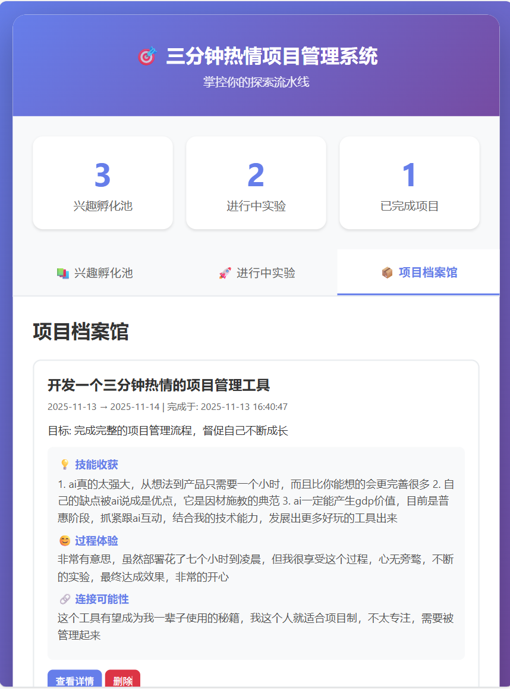

# 🎯 三分钟热情项目管理系统

> 为"三分钟热情"的你，量身定制的项目管理系统

## 📖 项目背景

你是否也有过这样的经历：
- 对很多事情都感兴趣，但总是"三分钟热情"？
- 想尝试新事物，但不知道如何系统化管理？
- 希望将短期的探索转化为有价值的学习和成长？

如果你也有这些困扰，那么这个系统就是为你而生的！

### 为什么开发这个系统？

传统的项目管理系统往往是为"长期深耕"设计的，但对于那些喜欢快速探索、快速学习的人来说，需要一个更轻量、更灵活的系统。

这个系统的核心理念是：
- **拥抱"三分钟热情"**：不要试图"治好"它，而是为其设计一套能够良性运转的"系统"
- **短平快的项目周期**：将探索过程系统化，使其不再是随性的"三分钟"，而是有管理的"探索流程"
- **连接多座岛**：不追求成为挖一口万米深井的专家，而要成为在知识海洋中快速架设桥梁的"通才"

## ✨ 核心功能

### 1. 📚 兴趣孵化池
记录所有让你心动的"三分钟"点子，这是你的待探索清单。随时添加想法，随时查看，随时启动实验。


### 2. 🚀 进行中实验
从孵化池中选择想法，启动一个短期实验（默认21天）。设定目标、预算和验收标准，记录进度，追踪剩余时间。


### 3. 📦 项目档案馆
实验结束后，进行复盘并归档。记录学到的技能、过程体验和连接可能性，让每个"三分钟"都成为成长的养分。



## 🎨 系统特点

- **📱 响应式设计**：完美支持桌面端和移动端，随时随地管理你的项目
- **💾 数据持久化**：使用MySQL数据库存储，数据安全可靠
- **☁️ Serverless部署**：支持腾讯云Serverless部署，零运维成本
- **🎯 极简设计**：界面简洁美观，专注于核心功能

## 🚀 快速开始

### 环境要求

- Python 3.6+
- MySQL 5.7+ 或 MySQL 8.0+
- 现代浏览器（Chrome、Firefox、Safari、Edge等）

### 安装步骤

1. **克隆项目**
```bash
git clone https://github.com/dengtiansheng/three_minutes_interests.git
cd three_minutes_interests
```

2. **安装依赖**
```bash
pip install -r requirements.txt
```

3. **配置数据库**

创建 `.env` 文件（参考 `env.example`）：
```bash
cp env.example .env
# 编辑 .env 文件，填入你的数据库配置
```

或者直接设置环境变量：

**Windows PowerShell：**
```powershell
$env:MYSQL_HOST="your-mysql-host"
$env:MYSQL_PORT="3306"
$env:MYSQL_USER="root"
$env:MYSQL_PASSWORD="your-password"
$env:MYSQL_DATABASE="threemins"
```

**Linux/Mac：**
```bash
export MYSQL_HOST=your-mysql-host
export MYSQL_PORT=3306
export MYSQL_USER=root
export MYSQL_PASSWORD=your-password
export MYSQL_DATABASE=threemins
```

4. **初始化数据库**
```bash
mysql -h your-mysql-host -u root -p < init_database.sql
```

5. **启动应用**
```bash
python app.py
```

6. **访问系统**
打开浏览器访问：`http://localhost:5000`

## 📦 部署到腾讯云Serverless

1. **安装Serverless Framework**
```bash
npm install -g serverless-cloud-framework
```

2. **配置环境变量**
在腾讯云Serverless控制台配置以下环境变量：
- `MYSQL_HOST`
- `MYSQL_PORT`
- `MYSQL_USER`
- `MYSQL_PASSWORD`
- `MYSQL_DATABASE`

3. **部署**
```bash
serverless deploy
```

## 📁 项目结构

```
three_minutes_interests/
├── app.py                      # Flask应用主文件
├── project_manager_mysql.py    # MySQL数据访问层
├── init_database.sql           # 数据库初始化脚本
├── requirements.txt            # Python依赖
├── serverless.yml              # Serverless部署配置
├── scf_bootstrap               # Serverless启动脚本
├── env.example                 # 环境变量配置示例
├── templates/                  # HTML模板
│   └── index.html
├── static/                     # 静态资源
│   ├── style.css
│   └── script.js
├── screenshots/                # 截图目录
│   └── README.md
└── README.md                   # 项目说明文档
```

## 🔧 技术栈

- **后端**：Flask 1.1.4（兼容Python 3.6）
- **数据库**：MySQL（通过PyMySQL连接）
- **前端**：原生HTML/CSS/JavaScript
- **部署**：腾讯云Serverless（Web Function）

## 💡 使用建议

1. **定期回顾**：每周回顾一次孵化池，选择最感兴趣的想法启动实验
2. **设定小目标**：每个实验的目标要具体、可达成，不要设定过于宏大的目标
3. **记录过程**：及时记录实验过程中的想法和收获
4. **复盘总结**：实验结束后，认真复盘，思考这个技能如何与已有技能连接

## 🤝 贡献

欢迎提交Issue和Pull Request！

## 📄 许可证

MIT License

## 🙏 致谢

感谢所有"三分钟热情"的朋友们，是你们让这个世界更加丰富多彩！

---

**记住**：你的"三分钟热情"不是需要克服的障碍，而是你的核心工作方式。拥抱它，管理它，让它成为你独特的优势！

